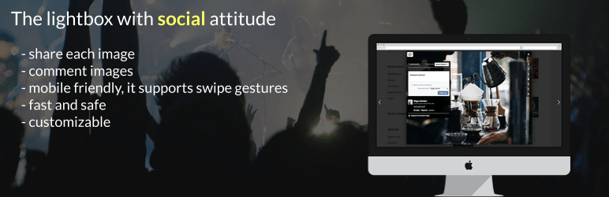

# EverlightBox

WordPress lightbox gallery with social attitude

EverlightBox has a very **social attitude**: users can share the image they're *currently* seeing and they can even write comments thanks to the Facebook comments widget.

EverlightBox is a very **fast** and **safe** lightbox for WordPress. It can be used with WordPress galleries like:

- WordPress native galleries
- [Final Tiles Gallery](https://wordpress.org/plugins/final-tiles-grid-gallery-lite/)
- [Modula Grid Gallery](https://wordpress.org/plugins/modula-best-grid-gallery/)
 
and any linked image. You can even activate it using custom CSS selectors, so it's virtually compatible with every gallery plugin.

EverlightBox is also a perfect solution for **mobile** devices, it supports swipe gestures so users are able to browse your images in a more natural way.

## Frequently Asked Questions

#### Does it work with WordPress native galleries?
Yes, sure!

#### Is it compatible with mobile devices like iPhone, iPad, Samsung, and other phones?
Yes it is. You can even use swipe gestures to browse all the images.

#### Can I share the image I'm currently viewing?
Yes, you can do it when you share the image on Facebook, Pinterest and Houzz. The other social networks doesn't have this feature.

## Contribute

There are many ways to contribute to EverlightBox.
* [Submit bugs](https://github.com/GreenTreeLabs/EverlightBox/issues) and help us verify fixes as they are checked in.
* Review the [code](https://github.com/GreenTreeLabs/EverlightBox/pulls).
* Engage with other EverlightBox users and developers on [StackOverflow](http://stackoverflow.com/questions/tagged/everlightbox). 
* Join the [#everlightbox](http://twitter.com/#!/search/realtime/%23everlightbox) discussion on Twitter.
* Contribute bug fixes.

## Changelog 

### 1.0.10
- [Add] New layout: buttons anchored to edges
- [Add] Facebook comment count

### 1.0.9
- [Fix] Images with query string are now correctly parsed

### 1.0.8
- [Add] Fullscreen button

### 1.0.7
- [Fix] Fixed download button after last update

### 1.0.6
- [Add] Facebook like button

### 1.0.5
- [Add] Close lightbox by clicking background

### 1.0.4
- [Meta] Added new question to FAQs in README.txt

### 1.0.3

- [Fix] Changed trigger event for mobile devices

### 1.0.2

- [Fix] Lost settings after page refresh

### 1.0.1

- When available, use data-title instead of title attribute to get the image caption

### 1.0

- First release!

## Author

EverlightBox is developed and mantained by Diego Imbriani - [GreenTreeLabs](http://www.greentreelabs.net). Forks are welcome!